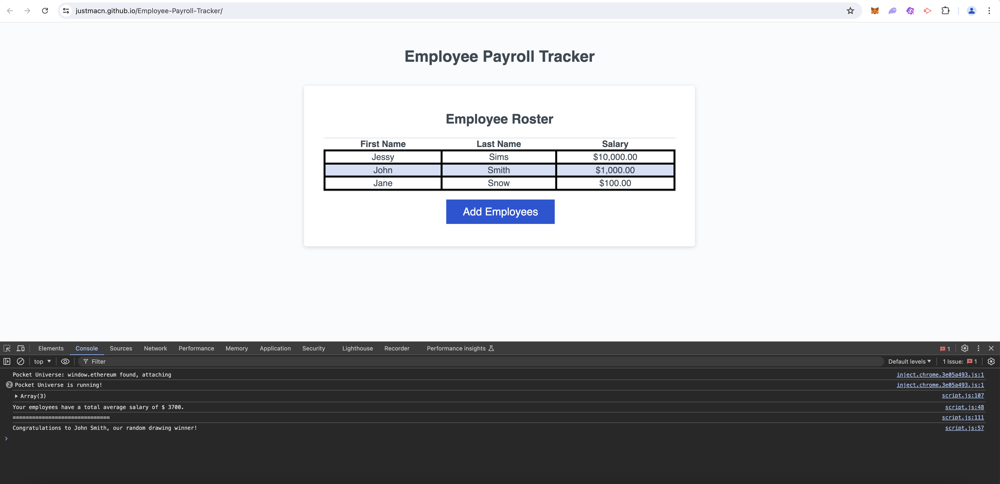

# Employee Payroll Tracker

## Descritpion

This project is a web application of an empoylee payroll tracker. It features Javascript and DOM manipulation to display a dynmaic table of inputed employee salaries. Checkout out the console log to see an auto generated average of all the salaries entered.

## Mock-Up

The following is a mock-up of the app:

## Links

The web application has been deployed below:

[Employee Payroll Tracker](https://justmacn.github.io/Employee-Payroll-Tracker/)

## Credits

The Starter Code was provided by edX Bootcamp.